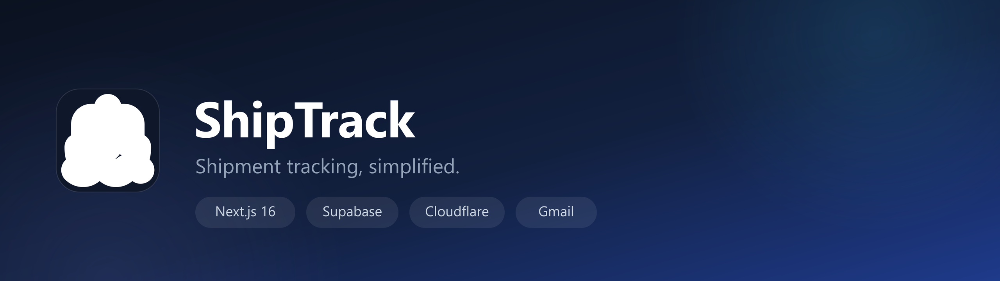

<p align="center">
  
</p>

<p align="center">
  <b>One clean dashboard for every shipment.</b><br/>
  Know where your cargo is, what's next, and who's handling it — without the spreadsheet chaos.
</p>

<p align="center">
  
  
  
  
  
  
  
  
</p>

---

## ✨ Features

- **Shipment tracking** — unified dashboard with status badges, filters, and a per-shipment tracking timeline.
- **Live courier status** — TrackCourier.io and Ship24 integrations with automatic provider **failover**, 15-minute caching, and graceful error states.
- **Automatic email discovery** — connect Gmail accounts (Google OAuth, read-only) and orders are detected and tracked automatically via modular parsers for Amazon, Flipkart, Myntra, Meesho, major couriers, and any brand (generic fallback).
- **Passwordless auth** — Supabase email OTP / magic-link sign-in, no passwords to store or leak.
- **Privacy by design** — Row Level Security keeps every user's data isolated; OAuth tokens are encrypted at rest (AES-256-GCM); courier API keys never leave the server.
- **Deployed on Cloudflare** — OpenNext Cloudflare adapter, Workers runtime, custom domain, static asset caching.

## 📖 Table of contents

- [Tech stack](#-tech-stack)
- [Getting started](#-getting-started)
- [Environment variables](#-environment-variables)
- [Scripts](#-scripts)
- [Deployment](#-deployment)
- [Features](#-features)
- [Security model](#-security-model)
- [Project structure](#-project-structure)
- [Common issues](#-common-issues)
- [Roadmap](#-roadmap)

---

## 🧱 Tech stack

| Layer     | Choice                                                                  |
| --------- | ----------------------------------------------------------------------- |
| Framework | Next.js 16 (App Router, React 19, TypeScript)                           |
| Styling   | Tailwind CSS v4 + [shadcn/ui](https://ui.shadcn.com) (Base UI components) |
| Auth      | Supabase Auth via `@supabase/ssr` (email OTP / magic link)              |
| Database  | PostgreSQL on Supabase (Row Level Security, schema in [`sql/`](sql/))   |
| Hosting   | Cloudflare Workers via [`@opennextjs/cloudflare`](https://opennext.js.org/cloudflare) |
| Integrations | TrackCourier.io · Ship24 · Gmail API (Google OAuth)                  |

---

## 🚀 Getting started

### Prerequisites

- Node.js **20+**
- npm
- A [Supabase](https://supabase.com) project (free tier is fine)
- A [Cloudflare](https://dash.cloudflare.com) account for deployment

### 1. Install

```bash
npm install
```

### 2. Configure environment variables

```bash
cp .env.example .env.local      # local dev (Supabase + build-time values)
cp .dev.vars.example .dev.vars  # Cloudflare runtime secrets (preview/deploy)
```

Fill in your values — see the [Environment variables](#-environment-variables) section.

> `.env.local` and `.dev.vars` are gitignored. The Supabase **anon key** is
> safe to expose in the browser — real security comes from Postgres Row
> Level Security. Never commit provider keys or OAuth secrets.

### 3. Set up Supabase

1. Create a project at [supabase.com/dashboard](https://supabase.com/dashboard).
2. **Authentication → Providers → Email** — enable **Email** with **"Enable email signups"** on.
3. **Authentication → URL Configuration** — add your site URLs:
   - Local: `http://localhost:3000`
   - Production: `https://track.sidcandev.online`
4. Copy the project URL and anon key from **Project Settings → API** into `.env.local`.
5. Run the migrations in [`sql/`](sql/README.md) from the **SQL Editor** (`0001` → `0005`, in order).

### 4. Run locally

```bash
npm run dev
```

Open http://localhost:3000 → **Sign in** → enter your email → enter the 6-digit
code from your inbox. New users are created automatically; returning users land
back on their existing dashboard.

> Using the Supabase CLI instead? Run `supabase start` and point
> `NEXT_PUBLIC_SUPABASE_URL` at `http://127.0.0.1:54321`.

---

## 🔐 Environment variables

| Variable                       | Where        | Secret | Purpose                                            |
| ------------------------------ | ------------ | :----: | -------------------------------------------------- |
| `NEXT_PUBLIC_SUPABASE_URL`     | Build + Worker |       | Supabase project URL (inlined at build time)       |
| `NEXT_PUBLIC_SUPABASE_ANON_KEY`| Build + Worker |       | Supabase anon key (public by design, RLS protects) |
| `TRACKCOURIER_API_KEY`         | Runtime      |   ✅   | TrackCourier.io API key (free tier: 100 req/mo)    |
| `SHIP24_API_KEY`               | Runtime      |   ✅   | Ship24 API key                                     |
| `INDIAN_COURIER_API_URL`       | Runtime      |       | URL of your self-hosted indian-courier-api service |
| `TRACKING_CACHE_TTL_MINUTES`   | Runtime      |       | Tracking cache TTL in minutes (default `15`)       |
| `GOOGLE_OAUTH_CLIENT_ID`       | Runtime      |       | Google OAuth client ID (email discovery)           |
| `GOOGLE_OAUTH_CLIENT_SECRET`   | Runtime      |   ✅   | Google OAuth client secret                         |
| `EMAIL_TOKEN_ENCRYPTION_KEY`   | Runtime      |   ✅   | 32-byte base64 key to encrypt OAuth tokens at rest |

- **`NEXT_PUBLIC_*`** values are inlined at **build time** — set them in the
  build environment (CI or the shell running the build) *and* on the Worker.
- **Runtime secrets** are read server-side only — store them as Cloudflare
  Worker **secrets**, never in code or build variables.
- Without any courier keys the app falls back to a clearly-labeled **mock**
  provider so the feature stays demoable.

Generate the encryption key:

```bash
node -e "console.log(require('crypto').randomBytes(32).toString('base64'))"
```

---

## 🧰 Scripts

| Command           | What it does                                          |
| ----------------- | ----------------------------------------------------- |
| `npm run dev`     | Next.js dev server (Node runtime)                     |
| `npm run build`   | Standard Next.js production build                     |
| `npm run lint`    | ESLint                                                |
| `npm run preview` | OpenNext build + run locally on the Workers runtime   |
| `npm run deploy`  | OpenNext build + deploy to Cloudflare                 |
| `npm run upload`  | OpenNext build + upload a new version                 |
| `npm run secrets` | Upload `.dev.vars` runtime vars to the Worker as secrets |

> ⚠️ **`npm run deploy` does NOT upload `.dev.vars` to the Worker.** The
> "Using secrets defined in .dev.vars" line in deploy output only means
> wrangler *read* the file locally. After adding or changing a runtime var,
> run **`npm run secrets`** (with `CLOUDFLARE_API_TOKEN` set) to push the
> values to the Worker as secrets.

---

## ☁️ Deployment

The app deploys to **Cloudflare Workers** via the OpenNext adapter and serves
from `https://track.sidcandev.online` (declared as a custom domain route in
[`wrangler.jsonc`](wrangler.jsonc)).

### First deploy

```bash
npm run deploy
```

Wrangler will ask you to log in to Cloudflare once. The Worker is named
`shipmenttracker`.

### Set production secrets

In the Worker dashboard → **Settings → Variables and Secrets**, add the
runtime vars from the [table above](#-environment-variables) as secrets.
Or push them from your machine:

```bash
CLOUDFLARE_API_TOKEN=... npm run secrets
```

### Continuous deployment (recommended)

Cloudflare Dashboard → **Workers & Pages → Create → Connect to Git**. Cloudflare
builds with `npm run deploy` on every push to the production branch. Keep
secrets in the Worker's **Variables and Secrets** settings — they never enter
the repo.

> **Windows note:** OpenNext works on Windows but is only *fully supported* on
> Linux/macOS. If you hit local build issues, use WSL or the GitHub →
> Cloudflare CI path.

---

## 🧭 Features

### Shipments (CRUD)

Add, edit, and delete shipments with a status badge (`pending`,
`in_transit`, `out_for_delivery`, `customs`, `delivered`, `cancelled`).
Mutations run through server actions with input validation; `user_id` is
always taken from the session, so no user can ever create rows for someone
else. Schema + RLS policies live in [`sql/0001_shipments.sql`](sql/0001_shipments.sql).

### Courier tracking

Each shipment's details page shows a tracking timeline. **Refresh tracking**
calls a secure serverless function that:

- Only refreshes shipments owned by the signed-in user (RLS + explicit lookup),
- Keeps courier API keys on the server,
- Dedupes new checkpoints into `tracking_history`,
- Caches successful refreshes for `TRACKING_CACHE_TTL_MINUTES` (default 15),
- Persists provider errors and surfaces them with proper HTTP codes.

Providers are a swappable chain (see [`src/lib/tracking/`](src/lib/tracking/)):

1. **TrackCourier.io** — Indian-first, 25+ couriers (set `TRACKCOURIER_API_KEY`)
2. **Ship24** — global aggregator with courier auto-detection (set `SHIP24_API_KEY`)
3. **indian-courier-api** — self-hosted scraper (set `INDIAN_COURIER_API_URL`)
4. **mock** — simulated timeline when none are configured

When multiple real providers are set they form a **failover chain** — each is
tried in order until one returns data.

> ⚠️ The `indian-courier-api` scraper targets AfterShip's pre-2023 DOM and
> **does not currently work** against their redesigned site. TrackCourier.io
> and Ship24 are the supported path.

### Automatic email discovery

Connect Gmail accounts (Google OAuth, `gmail.readonly` scope) and shipment
emails are discovered automatically:

1. **Scan** — recent Gmail messages matching shipment keywords (cheap headers only).
2. **Parse** — modular parsers for Amazon, Flipkart, Myntra, Meesho, major
   couriers, plus a **generic fallback** that catches any brand.
3. **Dedupe** — tracking numbers already on the dashboard are associated, never duplicated.
4. **Create** — new shipments get `source = 'email'`, the merchant, and estimated delivery.

Setup steps: enable the **Gmail API**, create a **Web application** OAuth
client in Google Cloud Console with redirect URI
`{your-origin}/api/emails/callback`, and set the Google vars + encryption key.
Details in [`.env.example`](.env.example).

Sync is idempotent and can run on a schedule later by pointing a Cloudflare
**Cron Trigger** at `POST /api/emails/sync` (protect it with a service token).

---

## 🛡️ Security model

| Layer              | How it's handled                                                                   |
| ------------------ | ---------------------------------------------------------------------------------- |
| Auth               | Passwordless email OTP. Session cookies via `@supabase/ssr`, refreshed by Edge middleware. |
| Authorization      | Every dashboard page *and* API route validates the session server-side.            |
| Data isolation     | Postgres **Row Level Security** on `shipments` and `connected_emails` (see [`sql/`](sql/)). |
| OAuth tokens       | Refresh tokens encrypted at rest (**AES-256-GCM**, key in `EMAIL_TOKEN_ENCRYPTION_KEY`); access tokens live in memory only. Tokens are never sent to the browser. |
| Email data         | Only tracking facts are stored — email bodies are parsed in memory and discarded.  |
| API keys           | Courier keys live in Worker secrets and are read server-side only.                 |
| OAuth CSRF         | `state` param + HttpOnly cookie, 10-minute expiry.                                 |

## 🗂️ Project structure

```
.
├── src/
│   ├── app/                     # App Router routes
│   │   ├── layout.tsx           # Root layout (fonts, theme, toaster)
│   │   ├── page.tsx             # Landing page
│   │   ├── login/               # Passwordless sign-in
│   │   ├── dashboard/           # Protected app shell, shipments, settings
│   │   ├── api/tracking/refresh # Serverless courier refresh
│   │   ├── api/emails/          # Gmail connect / callback / sync / disconnect
│   │   └── auth/                # OTP callback + signout handlers
│   ├── components/              # shadcn/ui, landing, auth, dashboard
│   ├── lib/
│   │   ├── tracking/            # Courier providers + refresh engine
│   │   ├── emails/              # OAuth, Gmail client, encryption, sync + parsers
│   │   └── supabase/            # server + client clients
│   └── middleware.ts            # Session refresh + route guard (Edge)
├── sql/                         # Postgres migrations (0001 → 0005)
├── public/                      # Static assets, manifest, icons
├── wrangler.jsonc               # OpenNext / Wrangler config
└── .env.example                 # Documented env vars
```

> **Why `middleware.ts` and not Next 16's `proxy.ts`?** Next 16 renamed
> middleware to `proxy.ts` and made it default to the Node runtime, which the
> OpenNext Cloudflare adapter doesn't support yet. This repo keeps the legacy
> `middleware.ts` (Edge runtime), which OpenNext fully supports. When OpenNext
> adds `proxy.ts` support, rename the file and `middleware` → `proxy`.

---

## 🐛 Common issues

- **Email shows a link but no code** — edit the **Confirm signup** and
  **Magic Link** templates in Supabase to include `{{ .Token }}` (see the
  sign-in flow). Supabase's default OTP length is 8 digits; set **Email OTP
  length** to `6` for a classic code.
- **Code never arrives / "Email not confirmed"** — check **Auth → Providers →
  Email** and **Auth → URL Configuration**; OTP codes expire, so use
  **Resend code**.
- **"For security purposes…" on send/verify** — Supabase rate-limits OTP
  requests; wait a minute and retry.
- **Session not persisting after deploy** — make sure
  `NEXT_PUBLIC_SUPABASE_URL` is set as a Worker variable *and* in the build
  environment, and that your domain is in Supabase's allowed redirect URLs.
- **Middleware deprecation warning** — expected on Next 16; see the
  `proxy.ts` note above.

---

## 🗓️ Roadmap

- [x] Landing page, Supabase auth, dashboard shell
- [x] Shipments CRUD + status badges + RLS
- [x] Courier tracking (TrackCourier + Ship24), timeline, caching
- [x] Automatic shipment discovery from connected emails
- [ ] Scheduled background sync (Cloudflare Cron Trigger)
- [ ] WhatsApp / email notifications on status changes
- [ ] Multi-carrier label generation

---

## 📄 License

[MIT](LICENSE) © 2026 [sidpi](https://github.com/sidpi).
